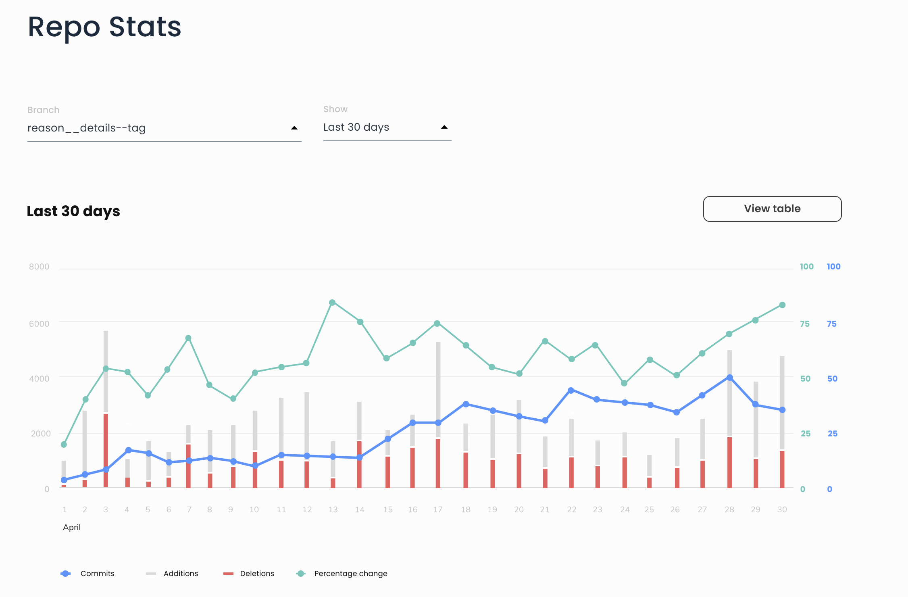

# gitwize-fe



This repository contains the frontend code of the GitWize project, which is a ReactJs-based application 

---

## Table of Contents

- [Introduction](#introduction)
- [Local Installation](#local-installation)
  - [Prerequisites](#prerequisites)
  - [Run the Project Locally](#run-the-project-locally)
- [Deployment](#deployment)
- [Contribution](#contribution)
  - [Branching Model](#branching-model)
  - [Review Process](#review-process)
- [Versions](#versions)
- [Licenses](#licenses)

---

## Introduction

GitWize is an AWS cloud-based application that allows you to extract valuable insights and metrics from a single GitHub repository using git commit logs. Currently, GitWize integrates Okta as the primary identity management service for end-users. Either if you’re a delivery manager, engineering lead, or engineering manager, GitWize will enable you to:

- Improve your software quality
- Track your project’s progress on a daily, monthly, or quarterly basis 
- Track your team’s productivity, performance, and health
- Identify early potential risks and take early measures that can save money, time, and stress

Once you add a GitHub repository to GitWize, you will unlock the following features:
- Analyze PR statistics such as average PR size and PR rejection rate
- Calculate code change velocity over time in terms of the number of commits
- Display reports in either tabular or chart format.

[⇧ back to top](#table-of-contents)

---

## Local Installation

To set up this project on you local machine, follow the next linux-based instructions.

### Prerequisites

Ensure you comply with the following prerequisites before you follow the rest of the instructions

- Install [Node.js](https://nodejs.org/en/) v13.11.0 or above \
  As of August 2022, v16.16.0 is functional. To check your Node.js version, type in your terminal: `node -v`

### Run the Project Locally

To run the frontend project on your machine:

1. Clone the `gitwize-fe` repository
2. Go to the `gitwize-fe` root directory
3. In your terminal, run `npm install`  \
This command installs the project’s dependencies located in the `package.json` file. If vulnerabilities are prompted after this installation step, type `npm node fix` to address related issues that do not require attention 
4. Run `yarn start` \
This command runs the project locally in a browser on [http://localhost:8080/](http://localhost:8080/). If prompted with the error `yarn: command not found` install the yarn package globally by running `sudo npm install --location=global yarn` and restart your terminal.
5. Run `yarn test` \
To launch the test runner in the interactive watch mode. 

[⇧ back to top](#table-of-contents)

---

## Deployment

To deploy the project locally, follow these steps:

1. Run `yarn build` \
To create a production build. 
2. Deploy the project \
The easiest way to deploy the content in the `build` folder is to install [serve](https://github.com/vercel/serve). In your terminal, type the following commands:
        ```
        sudo npm install --location=global serve
        serve -s build -l 8080
        ```
If you want to run the project in HTTPs, you’ll need an SSL certificate. For more details, consult [How to Use SSL in a Create-React-App Application](https://www.makeuseof.com/create-react-app-ssl-https/).

[⇧ back to top](#table-of-contents)

---

## Contribution

We encourage you to contribute to GitWize! Please check out our [Contributing guide](CONTRIBUTING)

[⇧ back to top](#table-of-contents)


### Branching Model

The branching model follows this convention: `<feature|bugfix>-<ticket-id>-<short-description>`  \
Example: `feature/GW-1-skeleton-code` and `bugfix/GW-10-some-blocker`

[⇧ back to top](#table-of-contents)


### Review Process

When sending a PR, ensure you include the following information:
```
What does this PR do?
Where should the reviewer start?
Screenshots & link (if appropriate)
Questions
```

[⇧ back to top](#table-of-contents)

---

## Versions

Versioning follows this convention: `<major>.<minor>.<buildnumber>` \
Example: 1.0.1 and 1.0.11

[⇧ back to top](#table-of-contents)

---

## Licenses

@[MIT](LICENSE) and @[CLA](CLA)

[⇧ back to top](#table-of-contents)
